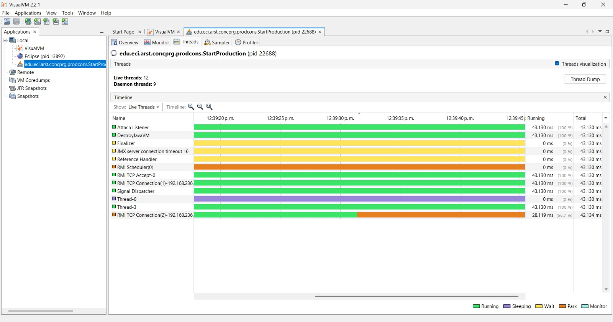
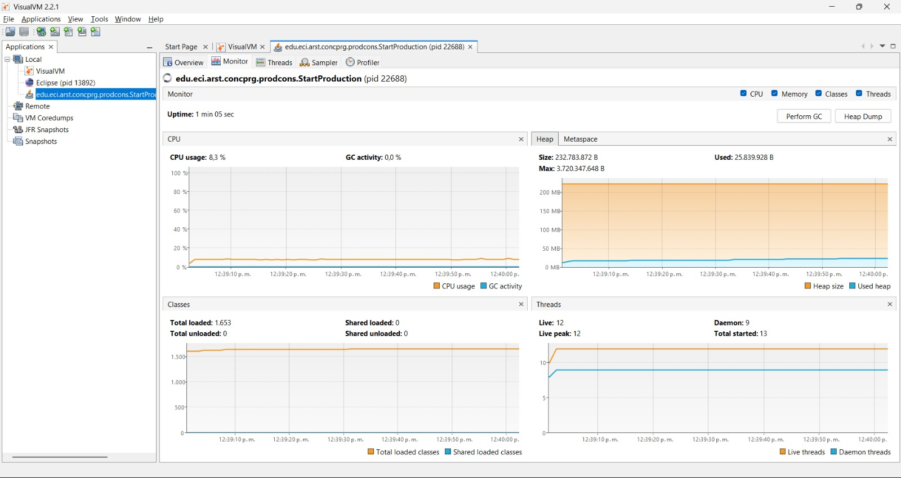

# Parte I – Punto 1: Consumo de CPU con JVisualVM

## Evidencia recolectada

**Imagen 1 – Pestaña "Monitor" de JVisualVM**


Como se observa en la imagen anterior, el proceso `edu.eci.arst.concprg.prodcons.StartProduction` mantiene un **consumo de CPU constante (~8%)** durante toda la ejecución, a pesar de que, en teoría, la mayor parte del tiempo la cola de productos está vacía (el productor es lento: produce cada 1 segundo).
 
---

**Imagen 2 – Pestaña "Threads" (Timeline), primer intervalo**


 
---

**Imagen 3 – Pestaña "Threads" (Timeline), segundo intervalo**



En las dos imagenes de la pestaña Threads se observa que:

- Thread-0 (el hilo `Producer`) aparece en color morado ("Sleeping") la mayor parte del tiempo, lo cual es coherente con el Thread.sleep(1000) que hay en su ciclo `run()`.
- Thread-3 (el hilo `Consumer`) aparece en color verde ("Running") el 100% del tiempo, de manera continua e ininterrumpida, sin nunca pasar a estado de espera o bloqueo.
---

## Análisis: ¿a qué se debe este consumo?

El consumo de CPU observado en el Monitor no proviene del productor (que duerme 1 segundo entre cada elemento producido, liberando el procesador), sino del hilo consumidor, que se mantiene en estado RUNNABLE de forma permanente.

Revisando el código de la clase `Consumer`:

```java
@Override
public void run() {
    while (true) {
        if (queue.size() > 0) {
            int elem = queue.poll();
            System.out.println("Consumer consumes " + elem);
        }
        // No hay ningún bloqueo/espera aquí
    }
}
```

El hilo consumidor ejecuta un ciclo `while(true)` que **pregunta continuamente** (`queue.size() > 0`) si hay elementos disponibles en la cola, sin ceder nunca el procesador cuando esta está vacía. Esto es lo que se conoce como **espera activa (busy-waiting / polling)**: el hilo nunca se "duerme", sino que sigue ejecutándose (consumiendo CPU) aunque no tenga trabajo real que hacer.

Esto es exactamente lo que confirma el timeline de JVisualVM: mientras el productor pasa la mayor parte del tiempo "Sleeping", el consumidor permanece siempre "Running" al 100%.

## Conclusión

- Causa del consumo de CPU: espera activa (busy-waiting) en el ciclo de consumo.
- Clase responsable: Consumer (método run()), por no usar mecanismos de coordinación entre hilos (wait()/notify(), o una BlockingQueue con take()) que permitan que el hilo se suspenda cuando no hay elementos que consumir, en lugar de seguir preguntando en un ciclo infinito.

---

# Parte II – Buscador de Listas Negras Optimizado con Detención Temprana

## Análisis de Requerimientos y Diseño

Para optimizar el buscador de listas negras distribuido (`HostBlackListsValidator`), se requería que la búsqueda se detuviera inmediatamente en el momento en que se detectara el número de ocurrencias requerido (`BLACK_LIST_ALARM_COUNT = 5`), garantizando la ausencia de condiciones de carrera.

### Solución Implementada:

1. **Mecanismo de Conteo Atómico Compartido (`AtomicInteger`)**:
   - Se introdujo una instancia compartida de `AtomicInteger globalOccurrencesCount` que es pasada a todos los hilos (`HostBlackListsValidatorThread`).
   - El método `incrementAndGet()` garantiza una modificación atómica del conteo global sin necesidad de bloqueos explícitos costosos ni provocar condiciones de carrera.

2. **Colección Sincronizada para la Recolección de Ocurrencias**:
   - La lista compartida de ocurrencias se creó utilizando `Collections.synchronizedList(new LinkedList<>())`.
   - Cuando un hilo detecta que una IP está en una lista negra, registra el ID de la lista en la colección compartida dentro de un bloque `synchronized`, evitando corrupción de memoria o pérdidas de datos por inserción concurrente.

3. **Estrategia de Detención Temprana**:
   - En cada iteración del ciclo `run()` de `HostBlackListsValidatorThread`, el hilo evalúa:
     ```java
     if (globalOccurrencesCount.get() >= alarmCount) {
         break;
     }
     ```
   - En cuanto `globalOccurrencesCount` alcanza el umbral de 5, cualquier hilo activo detecta esta condición en su siguiente iteración y rompe su ciclo de exploración inmediatamente.

4. **Conteo Preciso de Servidores Revisados**:
   - Cada hilo mantiene un contador local `checkedServersCount` que únicamente se incrementa cuando el hilo efectivamente realiza la consulta al servidor (`skds.isInBlackListServer(i, ipAddress)`).
   - Al finalizar con `join()`, el hilo principal suma los `checkedServersCount` individuales para reportar el total global consumido.

---

## Resultados de las Pruebas

- **IP Maliciosa / No Confiable (`202.24.34.55`)**:
  - Al ejecutar con 10 hilos, tan pronto como se detectaron las 5 ocurrencias tempranas (en las listas `[29, 10034, 20200, 70500, 31000]`), los hilos detuvieron la búsqueda.
  - **Servidores verificados**: `70,021` de `80,000` (se evitaron ~10,000 revisiones innecesarias).
  - **Resultado**: `HOST 202.24.34.55 Reported as NOT trustworthy`.

- **IP Confiable (`212.24.24.55`)**:
  - Al no encontrar ocurrencias de alarma, los hilos exploraron la totalidad del espacio de búsqueda distribuido.
  - **Servidores verificados**: `80,000` de `80,000`.
  - **Resultado**: `HOST 212.24.24.55 Reported as trustworthy`.
